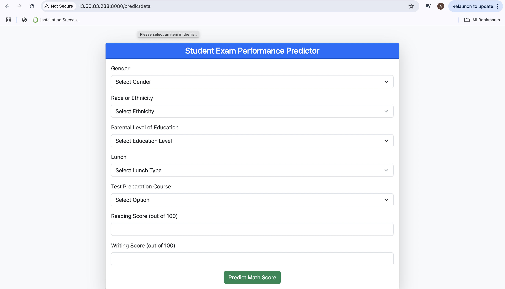
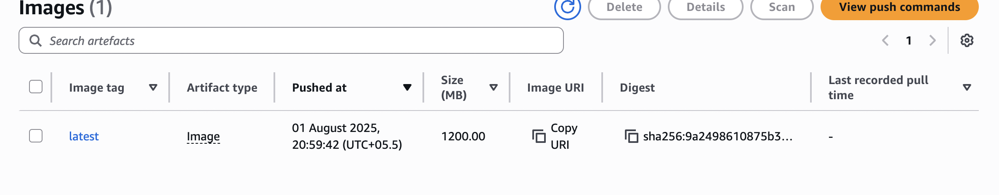

# AWS CI/CD

This codebase is more focused on a hands on approach with AWS and CI/CD pipelines . The emphasis is on learning good production practices and deployments with a primary focus on ECR , EC2 and GitHub Actions . 

# Images 

  
   
  <em>Student-Performance App</em>

  

  
   
  <em>ECR repo</em>

# Video 
You can watch the YouTube video I have uploaded [here](https://youtu.be/-tq5hBIaQYk) 

